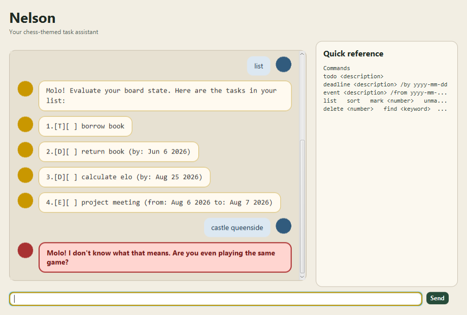

# Nelson

Nelson is a chess-themed desktop task manager for ToDos, deadlines, and
events. It combines a JavaFX interface with concise text commands and saves
changes automatically between sessions.



See the [Nelson User Guide](docs/README.md) for installation instructions and
the full command reference.

## Development

Nelson requires JDK 25. Run the automated checks and create the executable
fat JAR with:

```shell
./gradlew clean check shadowJar
```

The JAR is generated at `build/libs/nelson-all.jar`.

## Acknowledgements

This project was developed with assistance from OpenAI Codex for code,
testing, documentation, and workflow review. All generated changes were
reviewed and verified against the project requirements.
